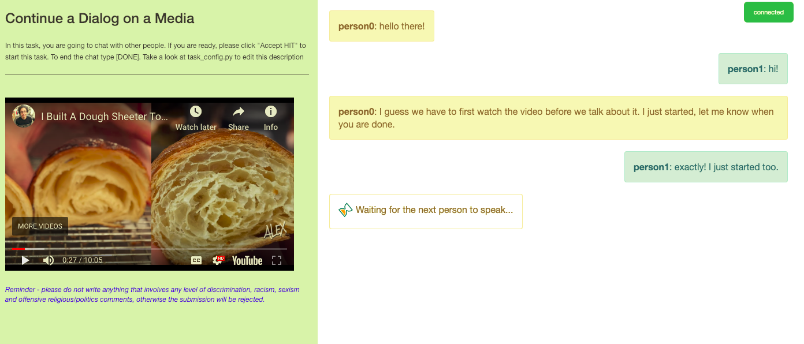

# Parlai101: Setting up a Visual Dialog Task with ParlAI

### Motivation

Let's say you want to do cool research on [analyzing conversations](http://vene.ro/constructive/niculae16constructive.pdf) or [visually grounded language in the context of dialog](https://arxiv.org/abs/1611.08669) but you don't know where to start to collect your data. [ParlAI](http://multicomp.cs.cmu.edu/) is an excellent platform to the job. I thought this could be an excellent topic for our one and a half day hackathon at [MultiComp Lab](http://multicomp.cs.cmu.edu/). Since none of the example tasks provides a visual dialog annotation with multiple participants, I attempted to add a Visual Dialog annotation task. It supports having a dialog task about an image or a video with more than 2 participants.

## Installation

Assuming you have conda installed in your environment you can run `install.sh` on your command line to install software requirements.
To be able to run and test the tasks on MTurk, you need at least one Amazon account and a Heroku account. Please follow necessary steps described in [here](http://www.parl.ai/static/docs/tutorial_mturk.html#running-a-task).

## Running a Task

First, make sure that you thoroughly read [ParlAI's MTurk document](http://parl.ai/static/docs/tutorial_mturk.html). Once you successfully create the accounts and do the installation, copy or soft link this repository's `visual_dialog` folder to `~/ParlAI/parlai/mturk/tasks`.
Run following commands to see command line options:

    source activate parlai
    cd ~/ParlAI/parlai/mturk/tasks
    python run.py  --help

The options I added to the examples [Multi Agent Dialog](https://github.com/facebookresearch/ParlAI/tree/master/parlai/mturk/tasks/multi_agent_dialog) and [Image Chat](https://github.com/facebookresearch/ParlAI/tree/master/parlai/mturk/tasks/image_chat) as follows:

    --use-local-human  Use local human agent (default: False) # Whether or not to use local human agent during annotation.
    --sample-task SAMPLE_TASK
		  image_dialog1  # Participants all see the same image and have a conversation about it.
		  image_dialog2  # Participants all see different images and have a conversation about it.
		  video_dialog   # Participants all see the same Youtube video and have a conversation about it.
		  video_dialog2  # Participants all see different Youtube videos and have a conversation about it.
		   (default: image_dialog2)
    --participants PARTICIPANTS
                        # of participants (default: 2) # The number of Turkers to participate in the conversation.

Once you run the task pay attention to the command line prompt to follow instructions and to get a link to the HIT.

## Customizing a Task

Probably the sample tasks I provide here are not taiolored to your needs. Here I list some pointers to the lines in the code where you might want to change for your specific needs.

* **On boarding the participants:** Let's say you want to first give a step-by-step tutorial to your Turkers on how to complete the task. You need to uncomment the line [here]](https://github.com/volkancirik/parlai101/blob/master/visual_dialog/run.py#L69) and you need to design a world [here](https://github.com/volkancirik/parlai101/blob/master/visual_dialog/worlds.py#L28).
* **Source of media:** Right know the source of media (e.g. [paths to images](https://github.com/volkancirik/parlai101/blob/master/visual_dialog/worlds.py#L61) and [links to videos](https://github.com/volkancirik/parlai101/blob/master/visual_dialog/worlds.py#L73)) are hardcoded. You need to do is load your sources before or during each conversation step and use them instead.
* **Different kind of media:** If you need to use a different kind of media, you need to add an html in [person0_index.html](https://github.com/volkancirik/parlai101/blob/master/visual_dialog/html/person0_index.html#L11) and also edit the javascript to set the source of media like I did it for [image](https://github.com/volkancirik/parlai101/blob/master/visual_dialog/html/person0_index.html#L83) and [video](https://github.com/volkancirik/parlai101/blob/master/visual_dialog/html/person0_index.html#L92).
* **Many participants:** If all participants share the same frontend all you have to do is copy link `visual_dialog/html/person0_index.html` as many times to `visual_dialog/html/person<# of participants>_index.html`. Right now I assumed there are only two Turkers thats why we only have one more soft linked file.
* **Recorded Data:** Write now the conversation data is stored in a pickle file as a list of tuples. None of these choices are optimal. You may want to change [what you record](https://github.com/volkancirik/parlai101/blob/master/visual_dialog/worlds.py#L93) and [the way you record](https://github.com/volkancirik/parlai101/blob/master/visual_dialog/worlds.py#L153) the data to a json format.

## What's Missing

The tasks I provide here are a result of ducttaping existing two tasks on the ParlAI repository. So, they miss a lot of features. A short list as follows:

* Media (i.e. image or the video) shows after participants salute each other. This is a simple bug that can easily be fixed, but I did not have time.
* As in [Image Chat task here](https://github.com/facebookresearch/ParlAI/blob/master/parlai/mturk/tasks/image_chat/image_chat_collection/worlds.py#L278), we can add a simple check to catch offensive language.
* Right now there is no check whether the dialog is successful or not. Again as in [here](https://github.com/facebookresearch/ParlAI/blob/master/parlai/mturk/tasks/image_chat/image_chat_collection/worlds.py#L335), we can check the status of Turkers to determine whether the dialog is successful.
* You probably want your Turkers to have some specific qualities to be eligible for your task but unfortunately I could not find a good example on how to do this, but [this is the starting point](https://github.com/volkancirik/parlai101/blob/master/visual_dialog/run.py#L72).
